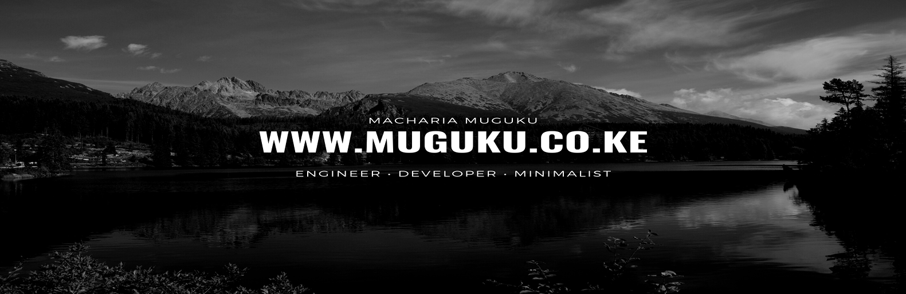

# 

&nbsp;&nbsp;&nbsp;&nbsp;&nbsp;&nbsp;

# Hi, I'm Macharia 👋🏾

I'm a Software Engineer from Nairobi, Kenya interested in Data Visualization, Artificial Intelligence and Internet Of Things.

I'm proficient in **Javascript** and **Go-lang** but the universe is conspiring against me to learn **Python**.

Frameworks and Technologies I work with include **React** (CRA, Gatsby and Nextjs), **React Native**, **Nodejs**, and **GraphQL**.

---

 

  

### My Passions 💪🏿

I'm passionate about Mental Health, Public Transport, and Governance. I ~~try to~~ practice Minimalism.

---

### My Digital Garden 🌱

I [Blog](https://medium.com/@iMash) once in a while and also occasionally rant on [Linked-in](https://www.linkedin.com/in/machariamuguku/)

---
